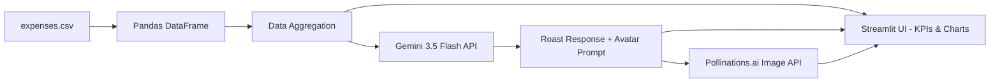

# 🔥 THE EXPENSE ROASTER

```text
================================================================================
  _____ _            _____                                
 |_   _| |__   ___  | ____|_  ___ __   ___ _ __  ___  ___ 
   | | | '_ \ / _ \ |  _| \ \/ / '_ \ / _ \ '_ \/ __|/ _ \
   | | | | | |  __/ | |___ >  <| |_) |  __/ | | \__ \  __/
   |_| |_| |_|\___| |_____/_/\_\ .__/ \___|_| |_|___/\___|
                                |_|                        
  ____                  _            
 |  _ \ ___   __ _ ___| |_ ___ _ __ 
 | |_) / _ \ / _` / __| __/ _ \ '__|
 |  _ < (_) | (_| \__ \ ||  __/ |   
 |_| \_\___/ \__,_|___/\__\___|_|   

 ROAST-ENGINE VER 3.5 // FINANCIAL TRUTH MACHINE
================================================================================
```

> Initializing Roast Engine...
> Loading expense profiles...
> Preparing savage-but-helpful financial feedback algorithms...

`The Expense Roaster` is a professional AI-powered personal finance dashboard built with **Streamlit**, **Pandas**, and the **Gemini 3.5 Flash API**. Users upload (or use a pre-loaded) CSV of their monthly expenses, and the app brutally roasts their spending habits while providing actionable recovery plans. A dynamic **Financial Avatar** (via Pollinations.ai) visualizes the user's spending behavior.

---

## 🛠️ System Architecture

```text
[CSV Expense Data] ──> [Pandas Aggregation] ──> [Streamlit SaaS Dashboard]
                                                        │
[Pollinations Avatar API] <─── [Gemini Roast Engine] <───┘
```



- **Frontend/Dashboard:** Streamlit
- **Data Processing:** Pandas
- **AI Brain:** google-genai SDK + Gemini 3.5 Flash
- **Image Engine:** Pollinations.ai API
- **Config:** Python-dotenv

---

## 📥 Setup & Installation

```bash
# 1. Clone this repository
$ git clone <your-repo-link>
$ cd miraiIntern

# 2. Create & activate virtual environment
$ python -m venv venv
$ venv\Scripts\activate        # Windows
$ source venv/bin/activate     # macOS/Linux

# 3. Install dependencies
$ pip install -r requirements.txt

# 4. Configure your API key
$ echo "GEMINI_API_KEY=your_key_here" > .env
```

---

## 🚀 Running the App

```bash
$ streamlit run expense_roaster.py
```

---

## ✨ Core Features

- **Phase 1 — Data Pipeline:** Synthetic 25-day expense dataset across 10 categories (Food Delivery, Shopping, Subscriptions, Transport, Entertainment, etc.).
- **Phase 2 — SaaS Dashboard UI:**
  - Sidebar controls: Monthly budget slider + category multi-select filter.
  - KPI cards: Total Spent, Budget Goal vs Actual (with `delta_color="inverse"`), Biggest Money Pit, Avg Daily Burn.
  - Charts: Daily spending bar chart, Category breakdown, Payment method distribution.
  - Expandable transaction table.
- **Phase 3 — AI Integration:** Gemini "Roast Master" persona analyzes spending categories and delivers savage-but-helpful financial advice with specific real-world alternatives and a recovery plan.
- **Innovation — Financial Avatar:** AI-generated image from Pollinations.ai visualizing the user's financial health status.

---

## 📁 Project Structure

```text
miraiIntern/
│
├── expense_roaster.py     # Main Streamlit application
├── expenses.csv           # Synthetic expense dataset
├── requirements.txt       # Python dependencies
├── .env                   # API keys (not pushed to GitHub)
├── .gitignore             # Excludes .env, venv, __pycache__
└── README.md              # This file
```

---

## 🔗 Live Demo

[**Click here to view the live app →**](#)
