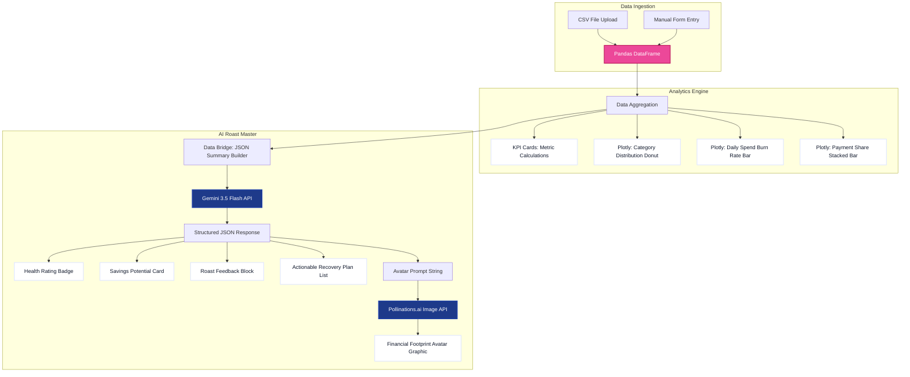

# MirAI School of Technology — Summer Internship 2026 Portfolio


<p align="center">
  
  
  
  
</p>

This repository contains the weekly assignments and the final Capstone project completed during the **MirAI School of Technology Virtual Summer Internship (AI Builder Track)**.

---

## 📂 Repository Directory Structure

```text
miraiInternship/
│
├── capstone_project/          # Final Capstone Project
│   ├── expense_roaster.py     # Streamlit application source
│   ├── expenses.csv           # Synthetic dataset (25-day record)
│   ├── requirements.txt       # Streamlit Cloud python dependencies
│   ├── .gitignore             # Subfolder ignore rules
│   └── README.md              # Capstone-specific documentation
│
├── assignment1.py             # Practice assignment scripts
├── assignment2.py
├── assignment3.py
├── assignment4.py
├── assignment5.py
├── assignment7.py
│
├── app.py                     # Initial chatbot applications
├── app2.py
├── app3.py
├── app4.py
├── app5.py
├── app6.py
├── app7.py
│
├── .gitignore                 # Root repository ignore rules
├── requirements.txt           # Main python dependencies (unpinned for cloud compatibility)
└── README.md                  # Main portfolio documentation (this file)
```

---

## 🏆 Capstone Project: Expense Roaster

**Expense Roaster** is a production-quality, AI-powered personal finance dashboard. Instead of simply presenting dry numerical data, the app acts as a brutal-but-fair lifestyle coach, using the Gemini API to analyze spending patterns and roast wasteful financial behaviors. 

It is fully deployed and accessible here:
🔗 **[Live Application Link](https://miraiinternship-8vbgfann2wttqxgpymeiwm.streamlit.app)**

### 🏗️ System Design & Architecture

The application implements a clean, reactive pipeline from data ingestion to metric cards, Plotly charts, and generative AI feedback loops.



---

### 🎨 Color & UI Redesign System
Taking inspiration from clean modern fintech dashboards, the interface features:
- **Main Background**: Lavender-blue tone (`#EEF2FF`) providing a premium contrast compared to default grey backgrounds.
- **Sidebar**: Deep navy gradient (`#1E3A8A` to `#1E40AF`) with highlighted light blue labels (`#BFDBFE`) for better readability.
- **Primary Accents**: Hot pink gradient (`#EC4899` to `#DB2777`) applied to key buttons and active indicators.
- **KPI Metrics**: Housed in clean white card containers with soft drop shadows and color-coded status indicators.

---

### 📥 Ingestion & In-Session Data Workflows

The dashboard provides a strict **Data-First** workflow. On startup, no metrics or placeholder charts are shown. The user is presented with two tabs to supply data:

```text
       [ Start Screen: Select Data Ingestion Source ]
                             │
            ┌────────────────┴────────────────┐
            ▼                                 ▼
   [ 📤 Upload CSV ]                 [ ✏️ Manual Form ]
   Drag-and-drop CSV file            Interactive form fields:
   containing transactions           Date, Item, Category,
   for custom batch loads            Amount, Payment Method
            │                                 │
            └────────────────┬────────────────┘
                             ▼
                 [ Load into Pandas Session ]
                             │
            ┌────────────────┴────────────────┐
            ▼                                 ▼
   [ 📊 Plotly Visuals ]             [ 🔥 Roast Engine ]
   Hover tooltips, zoom limits,     Data bridge exports metrics
   and category legend toggles      to Gemini for structured JSON
                                    grades and avatar rendering
```

---

## 🛠️ Setup & Local Installation

### Prerequisites
Ensure you have Python 3.10+ installed on your system.

### Running Locally
1. Clone the repository:
   ```bash
   git clone https://github.com/devkajals41/miraiInternship.git
   cd miraiInternship
   ```

2. Create and activate a virtual environment:
   ```bash
   # Windows
   python -m venv venv
   .\venv\Scripts\activate

   # macOS/Linux
   python3 -m venv venv
   source venv/bin/activate
   ```

3. Install requirements:
   ```bash
   pip install -r requirements.txt
   ```

4. Add your API key to a local `.env` file in the root directory:
   ```env
   GEMINI_API_KEY=your_actual_api_key_here
   ```

5. Launch the Streamlit dashboard:
   ```bash
   cd capstone_project
   streamlit run expense_roaster.py
   ```

---

## 🚀 Deployed Environment Config (Streamlit Secrets)
For the live deployed app, the Gemini API key is loaded securely via Streamlit Secrets. In your Streamlit Cloud Dashboard settings under **Secrets**, add the following variable:
```toml
GEMINI_API_KEY = "your_actual_api_key_here"
```

---

**© 2026 devkajals41. Completed as part of the MirAI School of Technology Virtual Summer Internship.**
