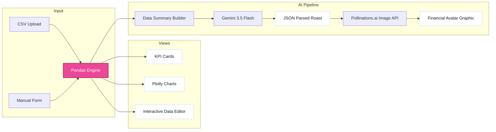

# 🔥 Capstone Project: Expense Roaster

```text
================================================================================
  _____ _            _____                                
 |_   _| |__   ___  | ____|_  ___ __   ___ _ __  ___  ___ 
   | | | '_ \ / _ \ |  _| \ \/ / '_ \ / _ \ '_ \/ __|/ _ \
   | | | | | |  __/ | |___ >  <| |_) |  __/ | | \__ \  __/
   |_| |_| |_|\___| |_____/_/\_\ .__/ \___|_| |_|___/\___|
                                |_|                        
  ____                  _            
 |  _ \ ___   __ _ ___| |_ ___ _ __ 
 | |_) / _ \ / _` / __| __/ _ \ '__|
 |  _ < (_) | (_| \__ \ ||  __/ |   
 |_| \_\___/ \__,_|___/\__\___|_|   

 ROAST-ENGINE VER 3.5 // FINANCIAL TRUTH MACHINE
================================================================================
```

This folder houses the **Expense Roaster** Streamlit application, a production-grade AI personal finance dashboard.

🔗 **[Live Deployed URL](https://miraiinternship-8vbgfann2wttqxgpymeiwm.streamlit.app)**

---

## 🏗️ Technical Pipeline & Design

The application links data ingestion, local pandas metrics aggregation, interactive Plotly charts, and structured LLM responses.



---

## 📂 Folder Files

- **`expense_roaster.py`**: The core Streamlit application. Contains all page configs, custom CSS, data loaders, state variables, and logic connectors.
- **`expenses.csv`**: A 25-day synthetic financial mock log containing various categories.
- **`requirements.txt`**: Unpinned library configuration containing core dependencies for Streamlit Cloud.
- **`.gitignore`**: Directory-specific gitrules preventing API keys and cache folder configurations from leaking.

---

## 🛠️ Run Locally

1. Open your terminal and navigate to this folder:
   ```bash
   cd capstone_project
   ```

2. Make sure your virtual environment is active:
   ```bash
   # Windows
   ..\venv\Scripts\activate

   # macOS/Linux
   source ../venv/bin/activate
   ```

3. Launch the dashboard:
   ```bash
   streamlit run expense_roaster.py
   ```

---

**Built as the Capstone assignment for MirAI School of Technology summer session.**
